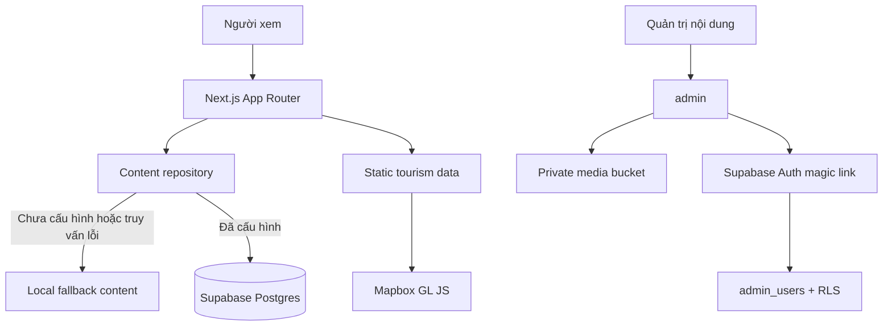

# Trà Linh – Đại ngàn Ngọc Linh

Website giới thiệu thiên nhiên, văn hóa Xơ Đăng, sản vật và hành trình tại vùng Trà Linh – Ngọc Linh. Bản `v1.0.0` gồm landing page công khai, bản đồ du lịch Mapbox, các trang nội dung chi tiết, form liên hệ và CMS Supabase dành cho quản trị viên.

Tài liệu này dành cho lập trình viên và người vận hành nội dung. Checklist tiếp nhận dự án nằm tại [HANDOVER.md](./HANDOVER.md).

## 1. Tính năng chính

- Landing page responsive với ảnh/video, hiệu ứng cuộn và hỗ trợ reduced motion.
- Trang chi tiết hành trình, sản vật, cẩm nang và địa điểm du lịch.
- Bản đồ Mapbox có tìm kiếm, lọc theo phạm vi/chủ đề, marker, popup và giao diện mobile.
- Dữ liệu fallback nằm trong source, nên website công khai vẫn chạy khi chưa kết nối Supabase.
- CMS Supabase dùng magic link, allowlist `admin_users`, RLS và private media bucket.
- Form liên hệ có validation, rate limit và lưu vào Supabase.
- Sitemap, robots, canonical metadata, Open Graph và Vercel Speed Insights.
- Unit test, accessibility/E2E test và visual regression bằng Vitest + Playwright.

## 2. Công nghệ

| Thành phần | Công nghệ |
| --- | --- |
| Web framework | Next.js 16 App Router |
| UI | React 19, TypeScript, Tailwind CSS 4 |
| Motion | GSAP, Framer Motion, Lenis, Embla |
| CMS/Auth/Database | Supabase |
| Bản đồ | Mapbox GL JS |
| Hosting | Vercel |
| Unit test | Vitest, Testing Library |
| E2E | Playwright, axe-core |

## 3. Kiến trúc



Luồng nội dung công khai ưu tiên dữ liệu `published` từ Supabase. Nếu Supabase chưa được cấu hình hoặc truy vấn thất bại, repository trả về nội dung đã tuyển chọn trong `lib/content`. CMS, form ghi dữ liệu và upload media chỉ hoạt động khi có đầy đủ biến Supabase phía server.

## 4. Route

| Route | Chức năng |
| --- | --- |
| `/` | Landing page chính |
| `/ban-do-du-lich` | Bản đồ và danh sách địa điểm đầy đủ |
| `/dia-diem/[slug]` | Chi tiết địa điểm/sự kiện |
| `/hanh-trinh/[slug]` | Chi tiết hành trình |
| `/san-vat/[slug]` | Chi tiết sản vật |
| `/cam-nang/[slug]` | Chi tiết cẩm nang |
| `/nhap-dia-diem` | Công cụ nhập và export JSON địa điểm trên máy local |
| `/chinh-sach-quyen-rieng` | Chính sách quyền riêng tư |
| `/admin/login` | Đăng nhập CMS bằng magic link |
| `/admin` | Quản trị nội dung và media |
| `/sitemap.xml`, `/robots.txt` | SEO machine-readable |

## 5. Cấu trúc thư mục

```text
app/                         Route, layout, metadata và server actions
components/                  UI, landing page, admin và tourism map
data/tourism-map/            Địa điểm, sự kiện, category và tọa độ
lib/content/                 Repository, fallback content, Supabase adapter
lib/supabase/                Auth, config, rate limit, upload và types
public/assets/               Media runtime của landing page
public/images/               Media tuyển chọn, placeholder và credits
scripts/                     Công cụ crawler ảnh staging
supabase/migrations/         Migration SQL forward-only
tests/unit/                  Unit/component tests
tests/e2e/                   Functional, accessibility và visual tests
docs/                        Ghi chú kỹ thuật chuyên sâu
```

Thư mục `asset/` chỉ là staging local của crawler, bị Git ignore và không được deploy. Media dùng bởi website phải nằm trong `public/` hoặc Supabase Storage.

## 6. Yêu cầu hệ thống

- Node.js `24.x` (xem `.nvmrc`).
- npm đi kèm Node.js.
- Git.
- Tùy chọn: Supabase CLI và tài khoản Mapbox/Vercel.

Kiểm tra phiên bản:

```bash
node --version
npm --version
```

## 7. Chạy local nhanh

```bash
git clone <repository-url>
cd tra-linh-landing-page
npm ci
cp .env.example .env.local
npm run dev
```

Trên PowerShell:

```powershell
Copy-Item .env.example .env.local
npm run dev
```

Mở `http://localhost:3000`. Nếu chưa điền Supabase, trang công khai dùng fallback content; CMS và form ghi dữ liệu sẽ báo chưa được cấu hình. Nếu chưa điền Mapbox token, danh sách địa điểm vẫn hoạt động và bản đồ hiển thị fallback rõ ràng.

## 8. Biến môi trường

Không commit `.env.local`. Các biến server-only chỉ được lưu trong máy phát triển hoặc Secret Manager của nền tảng deploy.

| Biến | Mức độ | Phạm vi | Môi trường | Mặc định / nơi lấy giá trị |
| --- | --- | --- | --- | --- |
| `NEXT_PUBLIC_SITE_URL` | Bắt buộc ở Production | Public | Development, Preview, Production | Local: `http://localhost:3000`; các môi trường khác dùng origin Vercel/domain tương ứng |
| `NEXT_PUBLIC_MAPBOX_ACCESS_TOKEN` | Bắt buộc để bật bản đồ | Public | Development, Preview, Production | Không có mặc định; tạo public token `pk.` trong Mapbox và giới hạn origin |
| `NEXT_PUBLIC_MAPBOX_STYLE_URL` | Tùy chọn | Public | Development, Preview, Production | `mapbox://styles/mapbox/standard`; lấy style riêng từ Mapbox Studio nếu cần |
| `NEXT_PUBLIC_SUPABASE_URL` | Bắt buộc cho CMS/form | Public | Development, Preview, Production | Không có mặc định; Supabase Project Settings → API |
| `NEXT_PUBLIC_SUPABASE_PUBLISHABLE_KEY` | Bắt buộc cho CMS/form | Public | Development, Preview, Production | Không có mặc định; Supabase Project Settings → API |
| `NEXT_PUBLIC_SUPABASE_ANON_KEY` | Legacy alternative | Public | Chỉ project Supabase legacy | Để trống nếu đã dùng publishable key |
| `SUPABASE_SERVICE_ROLE_KEY` | Bắt buộc cho CMS/form | Server-only | Development, Preview, Production | Không có mặc định; Supabase Project Settings → API; không thêm tiền tố `NEXT_PUBLIC_` |
| `RATE_LIMIT_SALT` | Bắt buộc ở Production | Server-only | Preview, Production; nên đặt cả Development | Không có mặc định; tạo chuỗi ngẫu nhiên riêng cho từng project |
| `SUPABASE_MEDIA_BUCKET` | Tùy chọn | Server-only | Development, Preview, Production | `media`; phải trùng bucket trong migration |

Biến dành riêng cho test:

| Biến | Mô tả |
| --- | --- |
| `BASE_URL` | Base URL nếu Playwright chạy với server bên ngoài |
| `E2E_MAPBOX_ACCESS_TOKEN` | Token chỉ dùng để bật live Mapbox E2E |
| `E2E_MAPBOX_STYLE_URL` | Style URL cho live Mapbox E2E |

## 9. Thiết lập Supabase mới

### 9.1 Tạo project và chạy migration

Tạo project Supabase mới, sau đó chạy toàn bộ file trong `supabase/migrations` theo thứ tự timestamp:

```bash
supabase login
supabase link --project-ref <project-ref>
supabase db push
```

Có thể chạy từng file trong SQL Editor cho lần thiết lập đầu tiên. Migration là forward-only: khi một migration đã chạy trên môi trường dùng chung, không sửa hoặc rollback file đó; hãy tạo migration timestamp mới.

Migration `202607270001_prepare_code_handover.sql` vô hiệu hóa admin và liên hệ của đơn vị bàn giao cũ. Không áp dụng migration này lên hệ thống cũ nếu người vận hành cũ vẫn cần truy cập.

### 9.2 Bootstrap quản trị viên đầu tiên

Sau khi migration hoàn tất, chạy trong SQL Editor và thay `<admin-email>` bằng email của bên nhận:

```sql
insert into public.admin_users (email, role, is_active)
values (lower(trim('<admin-email>')), 'admin', true)
on conflict ((lower(email))) do update set
  role = excluded.role,
  is_active = true,
  user_id = null,
  updated_at = now();
```

Không commit email thật vào migration. `user_id` sẽ được bind với tài khoản Supabase Auth trong lần đăng nhập magic link đầu tiên.

### 9.3 Auth redirect

Trong Supabase Authentication → URL Configuration:

- Site URL local: `http://localhost:3000`.
- Redirect local: `http://localhost:3000/admin/auth/callback`.
- Redirect production: `https://<domain>/admin/auth/callback`.
- Nếu dùng Vercel Preview, thêm đúng preview origin cần kiểm thử; không mở wildcard rộng hơn cần thiết.

### 9.4 Storage

Migration tạo bucket private `media` và RLS tương ứng. Chỉ asset có record `published` mới được cấp signed URL cho người xem. Upload được giới hạn bằng MIME type, extension và dung lượng ở cả ứng dụng lẫn database policy.

## 10. Thiết lập Mapbox

1. Tạo public access token trong Mapbox.
2. Chỉ cấp scope cần để tải styles/tiles.
3. Hạn chế URL cho domain production và các preview origin thực sự sử dụng.
4. Đặt token vào `NEXT_PUBLIC_MAPBOX_ACCESS_TOKEN`.
5. Giữ style mặc định hoặc cấu hình `NEXT_PUBLIC_MAPBOX_STYLE_URL` bằng URL `mapbox://styles/...` hay Mapbox Styles API hợp lệ.

Không đưa secret token vào biến `NEXT_PUBLIC_*`. Ứng dụng chỉ chấp nhận public token bắt đầu bằng `pk.` và Mapbox style URL hợp lệ.

## 11. Vận hành CMS

### Đăng nhập

1. Mở `/admin/login`.
2. Nhập email đã có trong `admin_users` và đang `is_active = true`.
3. Mở magic link từ cùng môi trường/domain đã cấu hình callback.
4. Lần đầu đăng nhập sẽ bind `user_id`; sau đó email đó không thể bind sang tài khoản Auth khác.

### Quy trình biên tập

- `draft`: nội dung đang soạn, không hiển thị công khai.
- `review`: chờ kiểm tra nguồn, quyền sử dụng hoặc nội dung.
- `published`: có thể hiển thị công khai nếu thỏa guard của schema.

Nội dung placeholder hoặc thiếu metadata nguồn/quyền sử dụng không được tự động coi là nội dung đã xác minh. Sau khi publish, kiểm tra lại trang công khai và metadata SEO.

### Thêm hoặc thu hồi người dùng

Thêm `admin` hoặc `editor` bằng SQL theo mẫu bootstrap. Để thu hồi ngay:

```sql
update public.admin_users
set is_active = false, updated_at = now()
where lower(email) = lower('<email-can-thu-hoi>');
```

Sau đó thu hồi session tương ứng trong Supabase Authentication nếu cần.

## 12. Quản lý bản đồ du lịch

- Địa điểm: `data/tourism-map/places.ts`.
- Sự kiện lặp lại: `data/tourism-map/events.ts`.
- Category/màu marker: `data/tourism-map/categories.ts`.
- Type: `data/tourism-map/types.ts`.
- Tọa độ đã rà soát: `data/tourism-map/tra-linh-verified-coordinates.json`.
- Helper filter, GeoJSON và Google Maps: `lib/tourism-map.ts`.

`v1.0.0` có 25 thực thể (23 địa điểm, 2 sự kiện) và 22 thực thể đủ điều kiện tạo GeoJSON. Mỗi entity phải có `id` và `slug` duy nhất. Chỉ dùng `coordinateStatus: "verified"` khi đã kiểm tra đúng địa điểm; tọa độ định hướng phải ghi `approximate`, còn record chưa có vị trí dùng `missing`. Route chi tiết và sitemap tự nhận entity `published`.

### Nhập thủ công

Mở `/nhap-dia-diem`, nhập từng record, lưu draft trong trình duyệt và chọn **Xuất JSON**. Draft chỉ nằm trong `localStorage` của máy đang dùng; không được gửi lên server.

### Crawler ảnh staging

```bash
npm run crawl:tourism-images
```

Kết quả nằm trong `asset/tourism-map-candidates/`, bị Git ignore và không tự xuất bản. Chỉ chuyển ảnh vào `public/` hoặc Supabase sau khi xác minh đúng địa điểm, nguồn và quyền sử dụng.

## 13. Kiểm thử

```bash
npm run lint
npm run typecheck
npm test
npm run test:coverage
npm run build
npm run test:e2e
```

Playwright mặc định chạy production server ở port `3100`, dùng Supabase giả lập không kết nối và kiểm tra fallback khi không có Mapbox token. Hook `pretest:e2e` tự chạy `npm run build:e2e`, tạo bundle test cô lập với `.env.local`. Để chạy live Mapbox E2E:

```powershell
$env:E2E_MAPBOX_ACCESS_TOKEN = "pk..."
npm run test:e2e:mapbox
Remove-Item Env:E2E_MAPBOX_ACCESS_TOKEN
```

```bash
E2E_MAPBOX_ACCESS_TOKEN="pk..." npm run test:e2e:mapbox
```

Cập nhật visual baseline chỉ sau khi đã xem ảnh diff:

```bash
npx playwright test tests/e2e/visual.spec.ts --project=chromium --update-snapshots
```

## 14. Deploy Vercel

1. Import repository mới vào Vercel.
2. Framework preset: Next.js; Root Directory: `.`.
3. Node.js: `24.x`.
4. Thêm environment variables cho Preview/Production theo bảng ở trên.
5. Build command: `npm run build`.
6. Deploy Preview, chạy smoke test, sau đó promote/deploy Production.

Deploy CLI khi project đã được link:

```bash
npx vercel
npx vercel --prod
```

Thêm hoặc đổi environment variable không cập nhật deployment cũ; phải redeploy.

## 15. Backup, migration và rollback

- Backup Supabase trước migration có dữ liệu hoặc thay đổi policy.
- Mọi sửa schema phải là migration timestamp mới.
- Rollback ứng dụng bằng deployment Vercel trước hoặc checkout tag Git trước.
- Không rollback database bằng cách sửa migration cũ. Tạo migration sửa chữa theo hướng tiến.
- Media private cần được backup riêng nếu không nằm trong database dump.

## 16. Troubleshooting

### `/admin` báo chưa kết nối CMS

Kiểm tra đủ `NEXT_PUBLIC_SUPABASE_URL`, publishable key và `SUPABASE_SERVICE_ROLE_KEY`; sau đó restart local server hoặc redeploy.

### Magic link quay về sai domain

Kiểm tra `NEXT_PUBLIC_SITE_URL`, Supabase Site URL và danh sách Redirect URLs. Giá trị phải có protocol và không có path dư.

### Không gửi được form

Kiểm tra service-role key, `RATE_LIMIT_SALT`, migration bảng submissions và log server. Không log payload chứa dữ liệu cá nhân.

### Bản đồ hiển thị fallback

Kiểm tra token bắt đầu bằng `pk.`, origin restriction, style URL và CSP trong `next.config.ts`. Dùng Network panel để xem response từ `api.mapbox.com`.

### Ảnh/video không tải

Với file local, kiểm tra đường dẫn tồn tại trong `public/`. Với Supabase, kiểm tra bucket, record media `published` và signed URL. Không thêm hostname mới vào CSP nếu chưa xác minh nguồn.

### Build hoặc visual test khác máy

Dùng Node 24, `npm ci` và Chromium do Playwright cài. Visual baseline hiện được duy trì trên Chromium/Windows; luôn xem diff trước khi cập nhật.

## 17. Bảo mật và quyền nội dung

- Không commit `.env.local`, service-role key, access token bí mật, file credential hoặc database dump.
- Public Mapbox/Supabase key vẫn phải được giới hạn đúng scope và origin.
- Admin authorization được kiểm tra phía server và kết hợp RLS; không dựa vào UI để bảo vệ dữ liệu.
- Không đưa ảnh crawler lên production khi chưa có bằng chứng quyền sử dụng.
- Credits của bộ media tuyển chọn nằm trong `public/images/tra-linh/CREDITS.md`.
- Bộ `public/assets` là media runtime của landing page; hồ sơ quyền sử dụng đầy đủ phải được bàn giao ngoài repository nếu chưa có văn bản trong repo.

Thông tin artifact, phạm vi và biên bản nghiệm thu: [HANDOVER.md](./HANDOVER.md).
